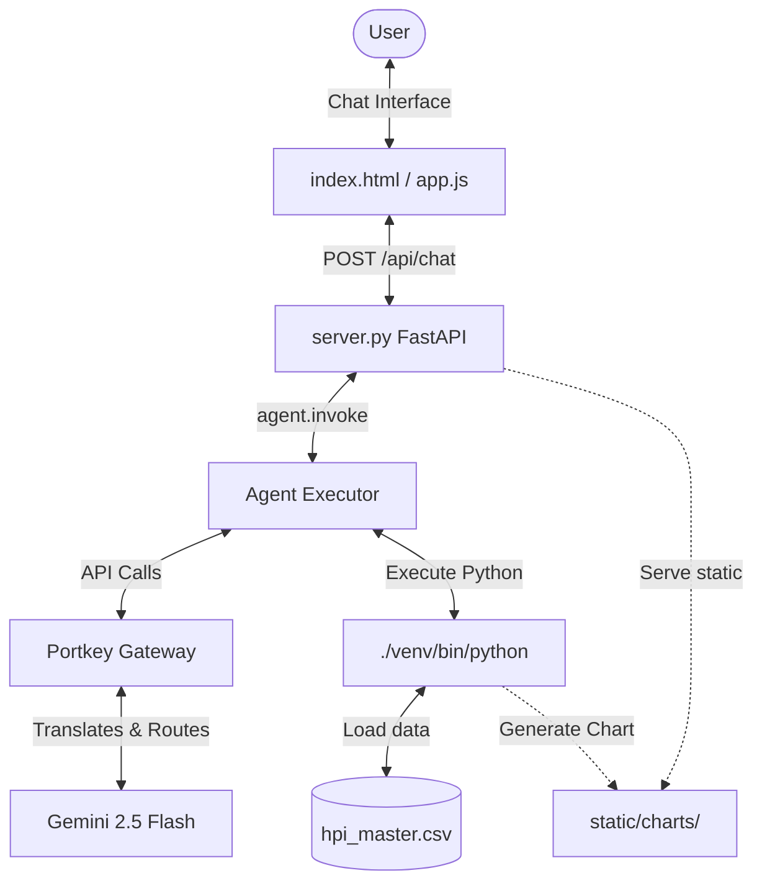

# HPI Web Application Design and Implementation Plan (Portkey Gateway)

This document outlines the architecture, layout design, and implementation steps to build a FastAPI server and Chat UI wrapping the HPI analysis skill using the Portkey API Gateway with provider slugs.

---

## 1. System Architecture

The application comprises three core components:
1. **Frontend UI**: A single-page, premium glassmorphism chat interface (HTML/CSS/JS) serving as the user entry point.
2. **REST API**: A FastAPI backend server that handles HTTP chat requests, manages session history/memory, and calls the LangChain Agent executor.
3. **Agent Runner**: A LangGraph-based agent runner that uses `langchain-openai` to route prompt requests and tool-calling flows through the Portkey API Gateway to Google Gemini 2.5 Flash.



---

## 2. Directory Structure

The files will be organized under the `deep-agents/` directory:

```text
deep-agents/
├── implementation_plan.md     # This design & plan file
├── requirements.txt           # Python packages specification
├── server.py                  # FastAPI server wrapping LangChain agent
└── static/                    # Frontend assets
    ├── index.html             # UI HTML
    ├── styles.css             # Glassmorphism visual styles
    ├── app.js                 # Frontend API client and rendering
    └── charts/                # Dynamic charts output folder (served as static files)
```

---

## 3. Environment & Execution Constraints

> [!CRITICAL]
> **Virtual Python Environment Requirement**:
> All installations, verification tests, and server operations **must** use the local python virtual environment (`./venv`) at the root of the project.
> - Install dependencies: `./venv/bin/pip install -r deep-agents/requirements.txt`
> - Run Server: `./venv/bin/python -m uvicorn deep-agents.server:app --reload`
> - Run tests and scripts: `./venv/bin/python <script_name>`

> [!IMPORTANT]
> **Configuration Setup**:
> Ensure you have created a `.env` file in the **project home folder** containing:
> ```text
> PORTKEY_API_KEY=your_portkey_api_key_here
> PORTKEY_PROVIDER_SLUG=your_google_provider_slug_in_portkey
> ```

---

## 4. Implementation Steps

### Step 1: Update Dependencies (`requirements.txt`)
Remove `langchain-google-genai` and add `langchain-openai`.

### Step 2: Update Backend Server (`server.py`)
- Load environment variables from `.env` using `python-dotenv`.
- Swap `ChatGoogleGenerativeAI` for `ChatOpenAI` from `langchain_openai`.
- Fetch Portkey credentials and model slug.
- Construct the model identifier string: `@{PORTKEY_PROVIDER_SLUG}/${MODEL}` and route via `https://api.portkey.ai/v1`.

### Step 3: Run Dependency Updates
Run `./venv/bin/pip install -r deep-agents/requirements.txt` to sync dependencies.

### Step 4: Verify
- Start the server on port 8000.
- Execute test chats using the UI to verify successful routing and graphing.
